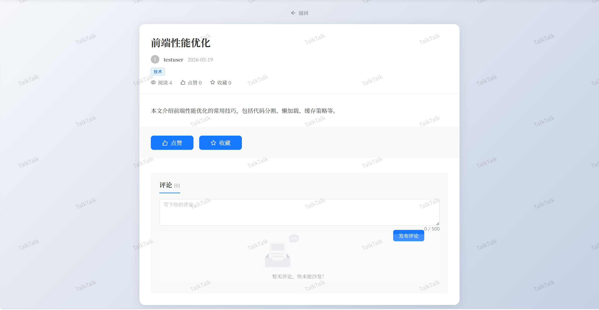

# TalkTalk

一个基于 Vue3 + Express 的现代化社区论坛平台。

## 功能特点

- 📝 **文章发布** - 支持发布长文，分享你的见解
- 💬 **社区互动** - 评论互动，结识志同道合的朋友
- ⭐ **收藏点赞** - 收藏喜欢的内容，支持作者
- 🏷️ **分类标签** - 按分类浏览，快速找到感兴趣的内容

## 技术栈

| 前端 | 后端 | 数据库 |
|------|------|--------|
| Vue 3 | Express.js | PostgreSQL |
| Vite | Node.js | Aiven Cloud |
| Ant Design Vue | bcryptjs | SSL 连接 |
| Vue Router | multer | |

## 页面展示

### 首页


### 文章


### 分类


## 项目结构

```
TalkTalk/                      # 前端项目
├── src/
│   ├── api/                   # API 封装层
│   ├── components/           # 组件
│   │   └── content/           # 页面组件
│   │   └── common/            # 公共组件
│   ├── view/                  # 视图页面
│   ├── router/                # 路由配置
│   └── assets/                # 静态资源
├── public/                    # 公共资源
├── screenshots/               # 页面截图
└── package.json

TalkTalk-Backend/              # 后端项目 (独立仓库)
├── talktalk.js               # 服务入口
├── database.js               # 数据库操作
├── package.json
└── vercel.json               # Vercel 部署配置
```

## 快速开始

### 前端

```bash
# 安装依赖
npm install

# 开发模式
npm run dev

# 构建生产
npm run build
```

### 后端

```bash
cd TalkTalk-Backend
npm install
node talktalk.js
```

## 环境配置

### 前端 (.env.local)

```env
VITE_BACKEND_URL=http://localhost:1000
```

### 后端 (.env.local)

```env
PG_HOST=your_host
PG_PORT=16904
PG_USER=avnadmin
PG_PASSWORD=your_password
PG_DATABASE=defaultdb
PORT=1000
```

## API 接口

| 接口 | 方法 | 说明 |
|------|------|------|
| `/register` | POST | 用户注册 |
| `/login` | POST | 用户登录 |
| `/getArticle` | POST | 获取文章列表 |
| `/db` | POST | 发布文章 |
| `/getClassify` | GET | 获取分类 |
| `/toggleLike` | POST | 点赞/取消 |
| `/toggleCollect` | POST | 收藏/取消 |
| `/addComment` | POST | 添加评论 |
| `/upload/*` | POST | 文件上传 |

## 部署

### 前端部署

部署到 Vercel:
```bash
npm run build
vercel --prod
```

### 后端部署

Vercel 会自动部署，请在 Vercel 后台配置环境变量：
- `PG_HOST`
- `PG_PORT`
- `PG_USER`
- `PG_PASSWORD`
- `PG_DATABASE`

## 相关链接

- 🌐 项目主页: https://talktalk.textline.top
- 🔌 后端服务: https://talktalkbackend.textline.top
- 💻 前端源码: https://github.com/TextlineX/TalkTalk
- 🛠️ 后端源码: https://github.com/TextlineX/TalkTalkBackend

---

作者: Textline | License: MIT